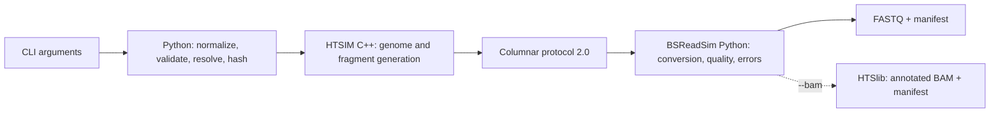

# BSReadSim architecture

Status: current architecture for BSReadSim 0.3.

BSReadSim has one runtime path. The C++17 HTSIM process generates biological
fragment templates and writes the columnar binary protocol. BSReadSim's Python
layer validates that stream, applies bisulfite conversion and sequencing
effects, and transactionally publishes either FASTQ or annotated BAM plus a
manifest. annotated BAM is the sole detailed details artifact and uses the Full
Details coordinate projection internally.



Protocol 1 and the pre-0.2 native programs are available from the `v0.1.0`
tag; they are not compiled, imported, selected, or documented as current
runtime alternatives.

## Ownership

HTSIM owns:

- reference, VCF, CGmap/bedMethyl, ASM/ASM BED, technology BED, and coverage-profile parsing;
- haplotype construction and coordinate projection;
- methylation-site catalogs and probability assignment;
- WGBS, RRBS, and TBS fragment selection;
- deterministic fragment allocation and the protocol writer.

Python owns:

- public CLI and output-policy selection;
- configuration validation, defaults, path resolution, and immutable-input
  hashing (the RRBS scored-candidate exchange uses regenerated-row matching);
- core lifecycle and strict protocol decoding;
- fragment-level bisulfite conversion before mate derivation, quality
  generation, and sequencing errors;
- bounded process scheduling and ordered output publication;
- FASTQ or annotated BAM, and the reproducibility manifest.

Scientific generation is not duplicated across languages. Python does not
reparse biological inputs, and C++ does not choose output paths, compression,
or Python worker scheduling.

## Source layout

The native tree is grouped by responsibility:

| Directory | Responsibility |
| --- | --- |
| `HTSIM/src/core` | argv validation, application assembly, generation loop |
| `HTSIM/src/reference` | FASTA loading and immutable contig storage |
| `HTSIM/src/variant` | variants, haplotypes, and coordinate projection |
| `HTSIM/src/methdb` | methylation sites, CGmap/bedMethyl and ASM/ASM BED inputs, and diploid MethDB catalogs |
| `HTSIM/src/model` | shared biological value types |
| `HTSIM/src/fragment` | fragment counts, allocation, insert lengths, and construction |
| `HTSIM/src/wgbs` | reference and haplotype-aware WGBS fragment selection |
| `HTSIM/src/rrbs` | restriction-site discovery, candidate catalog, and sampling |
| `HTSIM/src/tbs` | target BED projection, candidate catalog, and sampling |
| `HTSIM/src/protocol` | model-to-column adapter, ordered batch emission, and wire encoding |
| `HTSIM/src/shared` | RNG, distributions, SHA-256, and immutable text snapshots |

The Python package follows the runtime flow rather than historical feature
names:

| Package or module | Responsibility |
| --- | --- |
| `api.py` / `cli.py` | public Python and command-line entry points |
| `run/config.py` | schema validation and canonical configuration identity |
| `run/prepare.py` | seed materialization and immutable input snapshots |
| `run/execute.py` / `run/workers.py` | lifecycle, bounded scheduling, and ordered stage orchestration |
| `run/manifest.py` | completion contract, counts, identities, and artifact hashes |
| `native/launch.py` / `native/subprocess.py` | native argv projection, executable resolution, and process supervision |
| `native/protocol.py` | strict wire decoding and column validation |
| `process/batch.py` | immutable cross-stage records, columnar batches, and the canonical fragment/QNAME identity contract |
| `process/fragment.py` | fragment decoding, orientation, and the flat processing-flow coordinator |
| `process/methylation.py` | methylation-state assignment |
| `process/bisulfite.py` | physical fragment conversion |
| `process/sequencing.py` | read derivation, quality generation, and sequencing errors |
| `output/session.py` | staging, transactional publication, and cleanup |
| `output/fastq.py` / `output/bam.py` | artifact-specific serialization only |

Small compiled Python extensions accelerate protocol validation and common
post-processing loops. Their Python implementations remain the semantic
reference and are exercised by differential tests.

Cross-stage identity remains numeric in batch columns: contig name, zero-based
half-open reference envelope, and fragment ordinal. The canonical formatter in
`process/batch.py` materializes `contig:start-end:ordinal_hex` only when FASTQ
or BAM serialization needs it. Both mates share the fragment identity; no
million-read collection of QNAME strings is retained. Artifact-specific code
under `bsreadsim.output` does not own coordinate or ordinal semantics, protocol
decoding, RNG, biological models, or worker scheduling.

## Run sequence

1. The sole `bsreadsim run` command projects CLI arguments into an in-memory
   run document. The normalizer rejects unknown or invalid values, applies
   schema defaults, checks cross-field scientific rules, resolves paths, and
   freezes canonical JSON plus its SHA-256 identity for the manifest. No JSON
   run-configuration file is accepted. A normal run requests no Details-only
   protocol columns; `--bam` requests Full Details transport and switches
   the published data product from FASTQ to annotated BAM.
2. `run.prepare.prepare_run` materializes an omitted 64-bit seed once and hashes every
   reference, biological input, and model artifact. Declared model hashes are
   checked before any process starts or output directory is staged.
3. `native.launch` projects only C++-owned fields and verified paths/digests. The
   core independently validates argv syntax and the bytes it opens. Parsed
   argv and direct generator calls share one semantic validator for numeric
   ranges and technology combinations.
4. The core builds contig-level biological state, assigns stable fragment
   ordinals, and emits one header followed by ordered columnar batches and one
   trailer. Details are normative in [protocol.md](protocol.md).
5. `native.protocol` validates preamble, frame length, CRC32C, column bounds, header
   identity, batch order, and trailer counts before consuming data.
6. `run.execute` and `run.workers` pass decoded batches through the flat
   `process` flow. With `workers=1`, batches use one reusable process-local slot. With more
   workers, the supervisor remains the sole stdout reader and dispatches
   authenticated batches through bounded shared-memory slots. Results are
   written strictly by fragment ordinal.
   The uniform-model native columnar BAM lane carries up to 64 fragments per
   protocol batch. Paths that materialize Full Details objects, including the
   optional fragment summary, retain the eight-fragment lifetime bound.
7. `output.session` creates output files in a private staging directory. Counts and hashes
   are computed there; the manifest is published last as the completion
   marker. Existing destinations are never overwritten.

Each validation above protects a different boundary. Configuration is not
fully revalidated in preparation or argv projection; the immutable canonical
identity prevents mutation between those stages. Input bytes, untrusted core
bytes, and final output accounting are still checked where they enter their
respective trust boundary.

## Output policy

A normal run requests common protocol columns and creates R1, optional R2, and
a manifest. `--bam` requests Full Details columns and creates one unsorted
annotated BAM plus the manifest; FASTQ sidecars are deliberately omitted.
Workers derive reference-forward SAM records from the typed projection and
stream them through the statically linked HTSlib in `htsim-core`; no temporary
SAM is published. BAM finalization belongs to the same manifest-last
transaction. See [output-policy.md](output-policy.md) and
[bam-v3.md](bam-v3.md).

The third FASTQ line is exactly `+`. It carries no hidden annotation payload.

## RNG identity contract

The released RNG contract is `philox4x32-10+philox-domain-v2`. Philox remains
the stateless counter generator used for simulation draws; BLAKE2b is not part
of the RNG path. Domain keys are derived by one reserved Philox block:

```text
domain_key_entity = 0x4253522f4b455932  # numeric ASCII "BSR/KEY2"
domain_local      = (uint64(stage) << 32) | uint64(contig_index)
domain_block      = Philox4x32-10(master_seed,
                                  domain_key_entity,
                                  domain_local)
derived_key       = uint64(domain_block[0])
                    | (uint64(domain_block[1]) << 32)
```

`stage` is a frozen `uint32` enum:

| Value | Stage |
| ---: | --- |
| 0 | mutation |
| 1 | methylation-level |
| 2 | fragment |
| 3 | haplotype |
| 4 | site-state |
| 5 | library-orientation |
| 6 | conversion |
| 7 | quality |
| 8 | sequencing-error |

`contig_index` is the zero-based `uint32` ordinal in the verified reference
catalog and protocol header. Therefore changing reference contig order changes
the RNG stream even when names and sequences are otherwise identical. Names,
UTF-8 encoding, and string normalization never enter an RNG address.

HTSlib owns verified genomics parsing, decoded input access, and final BAM
serialization. It neither
defines random streams nor replaces the counter-based RNG: deterministic
worker/chunk invariance still requires explicit Philox addresses.

The ownership boundary is intentionally narrow. HTSlib 1.24 is fixed by the
top-level `HTSLIB/` gitlink and handles format detection, gzip/BGZF decoding,
VCF headers, records, alleles, and genotypes. BSReadSim still verifies raw
SHA-256 bytes through one stable descriptor and enforces its stricter FASTA,
single-sample VCF, BED6, coordinate, ordering, and variant-subset contracts.
Autotools runs only on a build-tree copy, so configuring never dirties the
submodule; the resulting core links HTSlib statically.

## Scientific invariants

- Reference intervals are zero-based, half-open `[begin, end)`; ordinal and
  offset arrays are monotone and bounds-checked.
- Complete diploid haplotypes and contig-level methylation catalogs are built
  before provider-specific fragment discovery.
- Methylation state and bisulfite conversion are physical fragment events.
  Conversion is attempted once per template offset before mate windows are
  derived, so overlapping mates observe the same converted molecule.
- Philox addresses stochastic decisions by numeric stage, contig index, fragment, mate,
  site, and cycle as applicable. Worker count, chunk size, and completion order
  cannot change generated reads.
- Details omission in the default FASTQ path removes Full Details transport,
  object construction, BAM serialization, and BAM I/O only. It cannot
  change fragment allocation, methylation probabilities, conversion, quality,
  or error draws.
- The manifest records normalized configuration, seed, input and output
  digests, component versions, stream digest, and reconciled core/Python
  counts.

Component-level algorithms remain versioned independently when their exact
definition affects reproducibility, for example
[`coverage-profile-target-v2`](coverage-profile-target-v2.md),
[`vcf-catalog-v1`](vcf-catalog-v1.md), and
[`sequencing-models-v1`](sequencing-models-v1.md). The `v1` in those names is
the component contract version, not the retired wire protocol.

## Failure and dependency policy

The core writes diagnostics only to stderr. Malformed CLI arguments, internal normalized
config values, or core argv fail before protocol output; a malformed stream,
failed child, count mismatch, or output collision aborts the staging
transaction. Partial files and a complete manifest are never published
together.

Runtime dependencies are limited to NumPy and JSON Schema validation. JSON
Schema is an internal normalized contract, not a required user-authored file.
It keeps type/default/range rules declarative for the direct CLI normalization boundary. Optional scientific behavior must be implemented as a
reviewed, versioned component rather than a dynamically loaded plugin.
