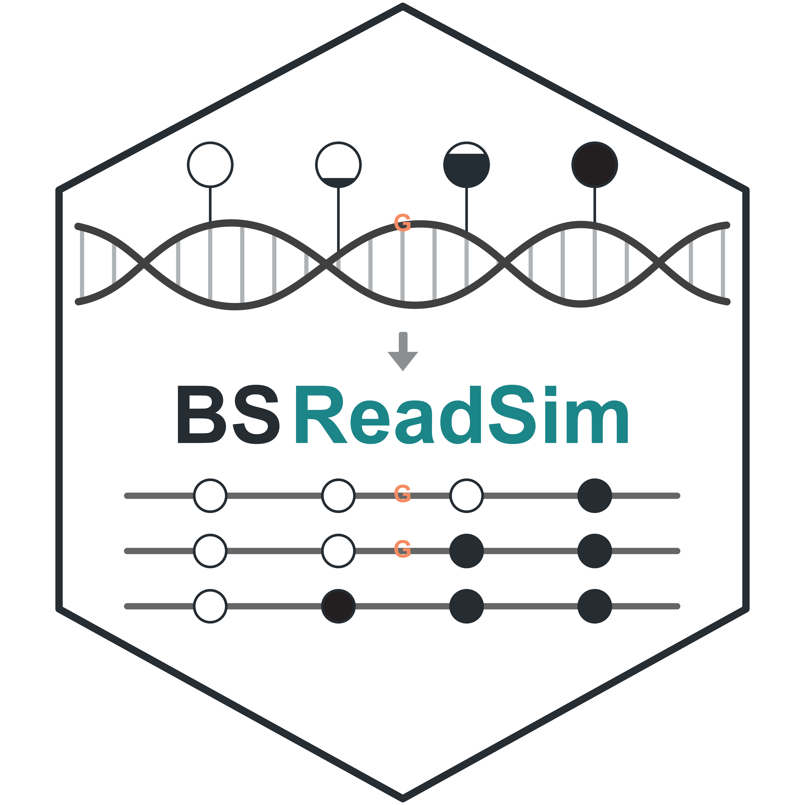

# BSReadSim

BSReadSim is a versatile and efficient read simulator for genomic sequencing, supporting both conventional and bisulfite-based assays. It combines genetic variation, DNA methylation, assay-specific sampling, bisulfite chemistry, and sequencing errors to produce realistic reads with traceable ground truth. The resulting data can be used to guide experimental design, develop bioinformatics tools, and benchmark their performance under controlled conditions.
Learn more in the [BSReadSim preprint](https://doi.org/10.1101/2024.12.24.627620).

[Quick start](getting-started/quickstart.md){ .md-button .md-button--primary }
[Workflow](simulation/workflow.md){ .md-button }

## Supported technology assays

BSReadSim focuses on bisulfite sequencing, with modes for WGBS, RRBS, and TBS. The same engine also supports WGS, WES, and targeted sequencing.

### WGBS

Whole-genome bisulfite sequencing profiles DNA methylation at single-base resolution across the genome.

[Configure WGBS](simulation/customize.md#wgbs)

### RRBS

Reduced representation bisulfite sequencing enriches CpG-rich fragments through restriction-enzyme digestion and size selection.

[Configure RRBS](simulation/customize.md#rrbs)

### TBS

Targeted bisulfite sequencing enriches predefined genomic regions through probe-based capture.

[Configure TBS](simulation/customize.md#tbs)

### Other assays

Additional support includes ordinary whole-genome, whole-exome, and targeted sequencing.

[Learn more](simulation/other-assays.md)

## Installation

Install the current release from source on Linux or WSL2.
A Bioconda package is coming soon.

[Installation guide](getting-started/installation.md){ .md-button .md-button--primary }
[Supported platforms](getting-started/platforms.md){ .md-button }

## Customize the simulation

Configure the biological and technical layer to match your study.

<ol class="simulation-flow">
  <li><strong><a href="simulation/customize/#genetic-variation">Genetic variation</a></strong>
  Generate SNVs and indels or incorporate sample variants from a diploid VCF.</li>
  <li><strong><a href="simulation/customize/#methylation">DNA methylation</a></strong>
  For bisulfite runs, generate context-specific methylation or incorporate measured and allele-specific profiles.</li>
  <li><strong><a href="simulation/customize/#supported-technologies">Sequencing assay</a></strong>
  Choose an assay and configure its fragment-sampling model. Options include WGBS, RRBS, and TBS, as well as <a href="simulation/other-assays/">Other genomic assays</a>.</li>
  <li><strong><a href="simulation/customize/#library-and-sequencing">Library and sequencing</a></strong>
  Configure fragment length, optional bisulfite chemistry, base quality, and sequencing errors.</li>
</ol>

[Customize](simulation/customize.md){ .md-button }
[View tutorials](simulation/tutorials.md){ .md-button }

## Understand the output

Every successful run produces reads as either FASTQ or annotated BAM, together with a run manifest.

- **FASTQ** provides standard reads and quality scores for existing analysis pipelines.
- **Annotated BAM** maps reads to their simulated origins and records applicable methylation/conversion plus variant and sequencing-error ground truth.
- **Simulation truth artifacts** preserve the prepared variant set as phased VCF and, for bisulfite modes, the prepared methylation profile as MethDB.
- **Run manifest** is pretty JSON recording the received command, an expanded full command, inputs, effective settings, random seeds, software versions, counts, and checksums.

[Explore outputs](outputs/index.md){ .md-button }
[View format reference](reference/formats.md){ .md-button }
